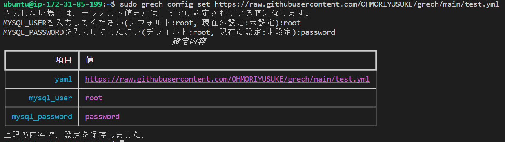
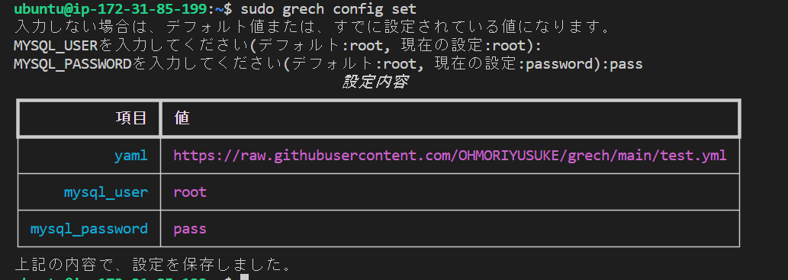
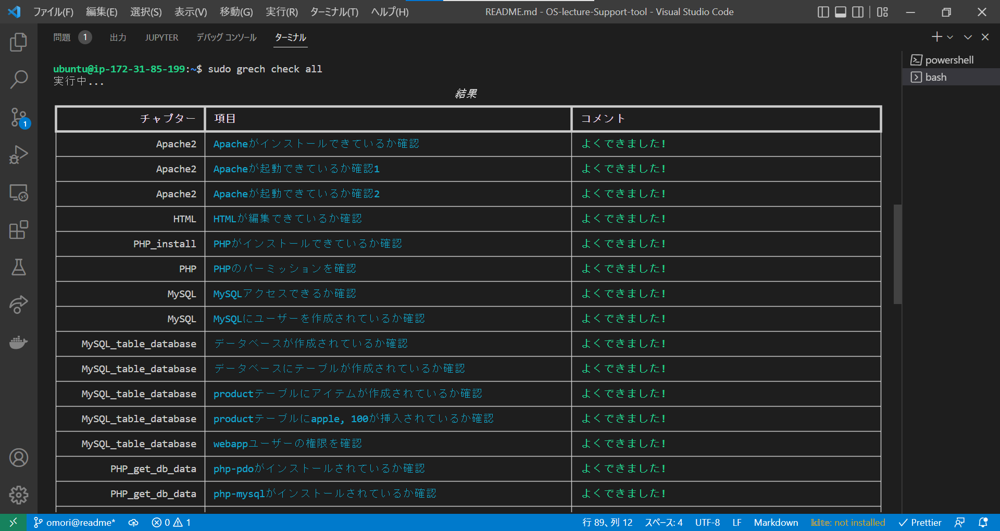
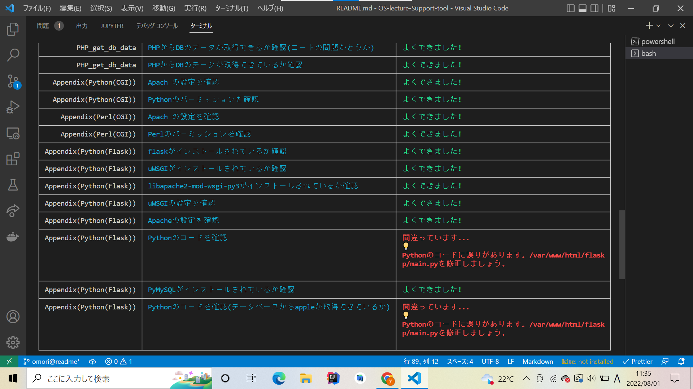
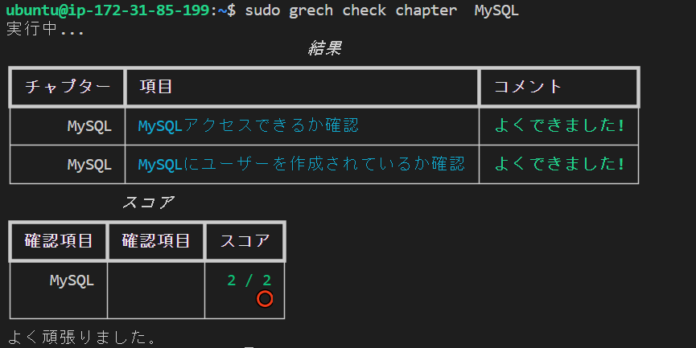
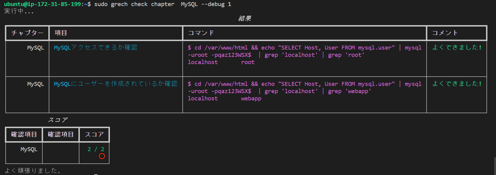
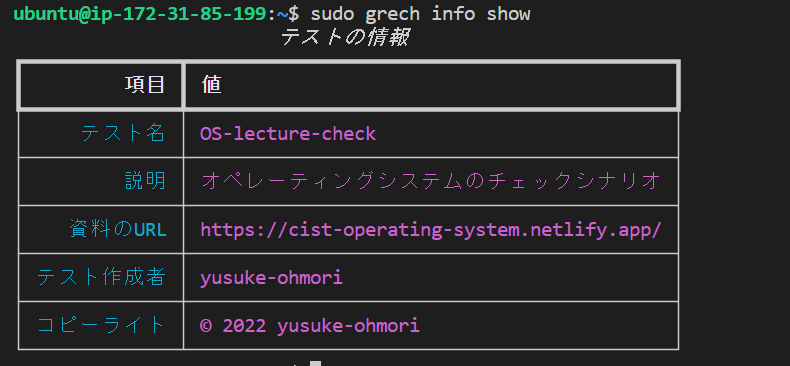

# grech

[](https://github.com/OHMORIYUSUKE/grech/actions/workflows/ci.yml)

<div align="center">

</div>

## 概要

YAML で定義された Shell を用いたテストを実行することができます。Shell を実行し、その結果が正規表現とマッチしているかどうかでテストの成功、失敗を判定しています。

## 用途例

サーバー構築などのハンズオンや演習のシナリオをテストしやすくするために使うことができます。  
演習者は、指定のテストが記載された YAML を読み込みテストを行います。YAML は演習者がテストを実行した際に読み込まれるので、指導者は、いつでも YAML を編集することができます。

## インストール

`pip`または`pip3`でインストールできます。

### `pip`

```sh
$ pip install https://github.com/OHMORIYUSUKE/grech/blob/release/grech-0.1.0-py3-none-any.whl?raw=true
```

### `pip3`

```sh
$ pip3 install https://github.com/OHMORIYUSUKE/grech/blob/release/grech-0.1.0-py3-none-any.whl?raw=true
```

## 使い方(YAML の書き方)

テストを定義する YAML は以下のように書きます。

### テスト部分

```yaml
# テストの名前
- name: Apacheがインストールできているか確認
      # 確認するためのコマンド
      cmd: apache2 -v
      # 複数の正規表現の「いずれかにマッチ」か「すべてにマッチ」を指定
      # or または andを指定
      regexp:
        - type: or
        # 正規表現
        - list: ["Server version: Apache/"]
      # 上記のコマンドを実行するディレクトリを指定
      working-directory: /home/ubuntu
      # 上記の正規表現にマッチしなかった場合に表示されるヒント
      message: |
        Apacheが正常にインストールできていない可能性があります。
```

### 定数

```yaml
# ユーザーごとに値が異なる場合に、ユーザーに指定してもらう
config:
  # rootはデフォルトでの値(ユーザーが設定しなければこの値になる)
  MYSQL_USER: root
  MYSQL_PASSWORD: root
```

テスト内で用いる変数を定義します。ユーザーごとに異なる値を用いたいときに設定します。

上記の例では、MySQL のパスワードをユーザーに設定させることができます。

### テストの情報

テストの情報を記載することもできます。
すべて任意なので、設定しなくても動作します。

```yaml
# このチェック項目の名前
name: OS-lecture-check
description: オペレーティングシステムのチェックシナリオ
# ハンズオンシナリオのURL
docs_url: https://cist-operating-system.netlify.app/
# 作者
author: yusuke-ohmori
# コピーライト
copyright: © 2022 yusuke-ohmori
```

詳細は[こちら](./test.yml)を確認してください。サンプルのテストの YAML です。

## 使い方(演習者)

### 初期設定



```sh
$ sudo grech config set https://path/to/test.yml
```

上記のようなコマンドを実行し、職設定を行ってください。

指導者が演習者ごとに設定してほしい値を対話形式で設定します。

> root で実行してください

### 設定を確認

```sh
$ grech config check
```


自身で設定した値を確認することができます。

### 設定を変更



```sh
$ sudo grech config set
```

２回目以降の設定は URL を引数に与える必要はありません。

対話形式で設定を変更することができます。

> root で実行してください

### すべてテスト

```sh
$ grech check all
```




すべてのテストを実行することができます。YAML に書かれたすべてのテストを実行します。

### 項目ごとにテスト

```sh
$ grech check chapter 項目名
```



テストしたい項目を指定して、テストを行うことができます。

引数にチェックしたい項目名を指定してください。

#### デバッグモード



```sh
$ grech check chapter 項目名 --debug 1
```

`--debug 1`を与えることで、どのようなコマンドでテストを行っているのかを確認することができます。

### テストの情報



```sh
$ grech info show
```

テストの作者や、このテストの演習資料の URL などを確認することができます。

## 開発したい方

ソースコードを編集して使いたい方は[こちら](./docs/development/README.md)を参考にしてください。
